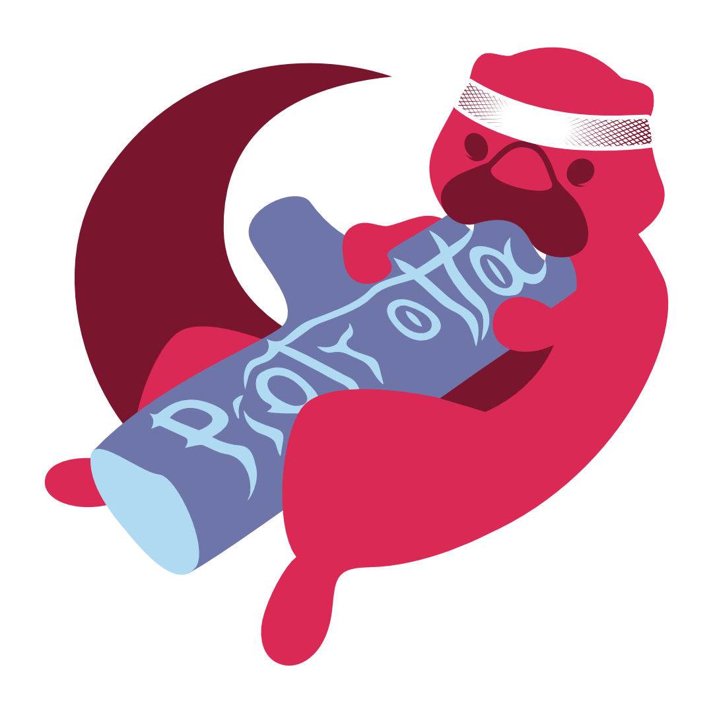

  

<h1 align="center" id="hello" style="margin-top: 2rem">Hello there! Welcome to my GitHub</h1>

I'm a 26 years old **Full Stack Web Developer** for 2 years and a **Game Developer** in my free time.

I specialize in **Vue 3** and **Node.js**. I'm also proficient in **Nuxt.js**, **NestJS**, and the **Quasar Framework**. There's more to my skill set, but let's keep it simple in here. Everything is in my CV.

> **And let’s keep it real**. You want results and I know how to deliver them.

Check what I'm capable off in my repos (preferably most recent).

<!-- <h2 align="center" id="contact">Showcase of project I was part of</h2>

WIP 🚧 I will update this section when portfolio app is finished. -->

<h2 align="center" id="recently" style="margin-top: 2rem">What I'm working on and learning currently</h2>

 MuscleMario game" title="Source: My repo -> MuscleMario game"/>

I'm currently developing a game in **Godot Engine** and building my personal **portfolio page** using **Three.js** and **NextJs** using **NextUI**. As you can see, I'm diving into **React** and **Three.js** to expand my frontend development skills.

<h2 align="center" id="contact" style="margin-top: 2rem">Contact</h2>

You can reach me on [LinkedIn](www.linkedin.com/in/piotr-otta) or by email: ottapiotr@gmail.com.

  Thanks for stopping by! Make sure to check out my repos.

   

