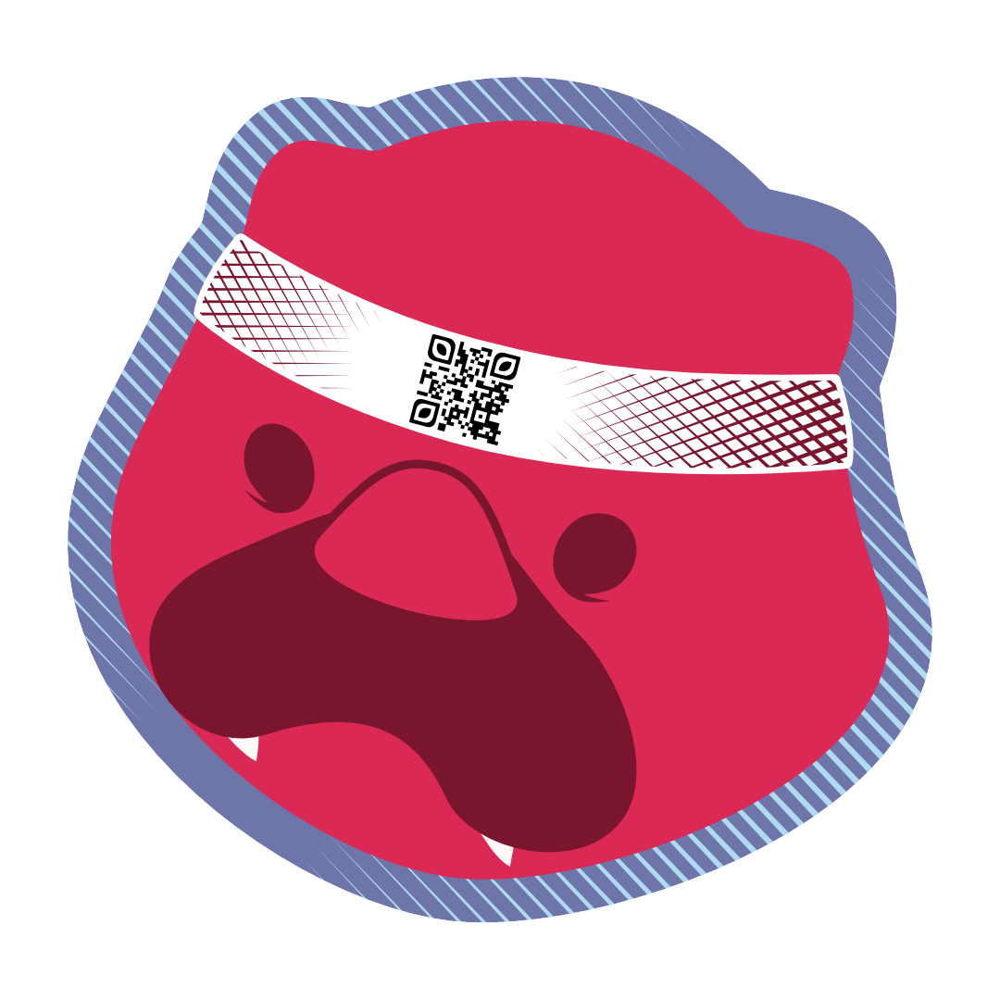

  

  
  

 

  

I'm a <b>Full Stack Web Developer</b> from  Poland with a bit over 2 years of experience. In my free time I'm diving into <b>Game Development</b> and working on <b>art commisions</b>.
  
Here are technologies I'm most proficient with:

  
  
  
  
  
  
  
  
  
  
   
  
  
  
  
  
  
  
  
  
  

 

And here are technologies I used quite recently:

  
  
  
  
  
   
  
   
  
  
  
  
  
  
  
  

 

    
   MuscleMario game" title="Source: My repo -> MuscleMario game"/>
  WIP 🚧 I will update this section when portfolio app is finished.
   

    
  I'm currently developing a game in <b>Godot Engine</b> and building my personal <b>portfolio page</b> using <b>Three.js</b> and <b>NextJs</b> with the <b>NextUI</b> framework.

  
   
  You can contact me on 
   
  or via email: <a href= "mailto: ottapiotr@gmail.com"> 
      ottapiotr@gmail.com
   </a>

---

  Thanks for passing by! Make sure to check out my repos.
   

